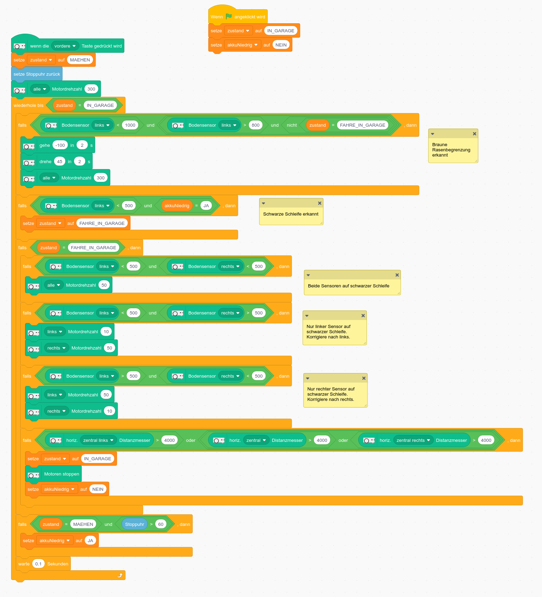
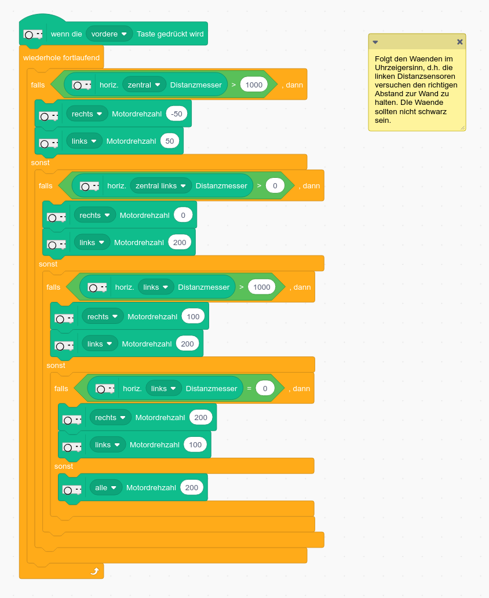

# Thymio programmieren
Hinweis: Schaue dir diese Seite im Internet an. Dort kannst du auf die Links für die Dokumentation klicken,
und die Lösungsprogramme herunterladen:

https://github.com/apfeuti/thymio-lektion

## Aufgabenstellung
Wir wollen einen Rasenmäher-Roboter simulieren. Das braune Klebeband begrenzt die Rasenfläche und die schwarze
Klebeband-Schleife zeigt dem Roboter den Weg zurück in die Garage. (Bei richtigen Rasenrobotern wären die Begrenzungen
Stromkabel, welche unter dem Rasen verlegt sind, sogenannte Induktionsschlaufen)
- Wir starten den Roboter mit einer Berührung auf den Vorwärtspfeil
- Der Roboter fährt (mäht den Rasen) bis er die braune Begrenzung erkennt
- Dann fährt er für 2 Sekunden rückwärts
- Er dreht während 2 Sekunden
- Jetzt fährt (mäht) er weiter
- Nach einer Minute soll ein niedriger Akkustand simuliert werden
- Wenn der Roboter jetzt die schwarze Schleife erkennt, soll er ihr zurück in die Garage folgen
- Wenn er den Markierungsgegenstand in der Garage erkennt, soll er stoppen


## Lösung
Den Thymio programmiert man ereignis-orientiert, d.h. wir teilen dem Thymio mit, was er bei bestimmten Ereignissen machen soll.
Für unsere Lösung sind folgende Ereignisse relevant:
- Bodensensor erkennt braune Begrenzung
- Bodensensoren erkennen schwarze Schlaufe
- Ein gewisse Zeit ist abgelaufen (1 Sekunde für rückwärtsfahren und drehen, eine Minute für den tiefen Akkustand)
- Vordere Sensoren erkennen Markierungsgegenstand (gelber Notizblock) in Garage

Wir überlegen uns, in welchen Zuständen sich der Roboter befindet, und welche Ereignisse den Roboter von einem Zustand
in den anderen überführen. Das ergibt folgendes Zustandsdiagramm:


### Lösung mit Aseba
#### Wichtige Dokumentation zu Aseba
- [Aseba Programmiersprache](http://aseba.wikidot.com/de:asebalanguage)
- [Sensoren und Aktoren API](http://wiki.thymio.org/de:thymioapi)

#### Programm
Die Datei zum Download findest du [hier](src/aseba/rasenmäher-roboter.aesl)

Zuerst, definiere folgende Konstanten:
- IN_GARAGE 0
- MAEHEN 1
- ZURUECK_FAHREN 2
- DREHEN 3
- FAHRE_IN_GARAGE 4
- FALSE 0
- TRUE 1

```
# Zustände initialisieren
var zustand = IN_GARAGE
var akkuNiedrig = FALSE


# Vorwärtspfeil auf Thymio berührt
onevent button.forward
		zustand = MAEHEN
		
		# fahre geradeaus mit Geschwindigkeit 300
		motor.left.target = 300
		motor.right.target = 300
		
		# starte Timer ca 1 Minute (länger geht leider nicht)
		# Trick 2 * 30000, weil keine grössere Zahl als 32767 angegeben werden kann
		timer.period[1] = 2 * 30000
		
		
# Notstop wenn Rückwärtspfeil auf Thymio berührt
onevent button.backward
		motor.left.target = 0
		motor.right.target = 0

# Sensoren-Ereignisse
onevent prox
	if prox.ground.delta[0] < 1000 and prox.ground.delta[0] > 800 and zustand != FAHRE_IN_GARAGE then
			# Bodensensoren haben brauner Rand entdeckt
			# Die Werte 1000 und 800 muss man je nach Klebeband durch ausprobieren herausfinden
			zustand = ZURUECK_FAHREN
			
			# Fahre rückwärts mit Geschwindigkeit 100
			motor.left.target = -100
			motor.right.target = -100
			
			# starte Timer 2 Sekunden
			timer.period[0] = 2000
	end
	
	if prox.ground.delta[0] < 500 and akkuNiedrig == TRUE then
		# Bodensensoren haben schwarze Schleife entdeckt und Akku stand ist niedrig (simuliert)
		zustand = FAHRE_IN_GARAGE
	end
	
	if  zustand == FAHRE_IN_GARAGE then
	    if prox.ground.delta[0] < 500 and prox.ground.delta[1] < 500 then
	    	# genau auf schwarzer Linie - fahre gerade aus
	    	motor.left.target = 100
	    	motor.right.target = 100
	    end
	    
		if  prox.ground.delta[0] < 500 and prox.ground.delta[1] >= 500 then
			# Nur noch der linke Bodensensor ist auf der schwarzen Schleife -> korrigiere nach links
			# rechtes Rad schneller drehen als linkes Rad
			motor.left.target = 10
			motor.right.target = 100
		end
		
		if  prox.ground.delta[0] >= 500 and prox.ground.delta[1] < 500 then
			# Nur noch der rechte Bodensensor ist auf der schwarzen Schleife -> korrigiere nach rechts
			# linkes Rad schneller drehen als rechtes Rad
			motor.left.target = 100
			motor.right.target = 10
		end
		
		if  prox.horizontal[1] > 4000 or prox.horizontal[2] > 4000 or prox.horizontal[3] > 4000 then
		   # Einer der mittleren drei Vordersensoren haben den Markierungsgegenstand in der Garage erkannt
			zustand = IN_GARAGE
			
			# Stoppe
			motor.left.target = 0
			motor.right.target = 0
			
			# Akku ist wieder geladen :-)
			akkuNiedrig = FALSE
		end
			
	end
	
	
onevent timer0
	if  zustand == ZURUECK_FAHREN then
	   # Zurückfahrzeit ist abgelaufen - jetzt drehen
		zustand = DREHEN
		
		# Räder in entgegengesetzte Richtung drehen
		motor.left.target = 100
		motor.right.target = -100
		
		# Timer neu starten (für das Drehen) und Routine verlassen
		timer.period[0] = 2000
		return
	end
	if zustand == DREHEN then
	# Drehzeit ist abgelaufen - jetzt wieder vorwärtsfahren und mähen
	   zustand = MAEHEN
	   motor.left.target = 300
	  motor.right.target = 300
	  return
	end	
	
onevent timer1
    # simuliere, dass Akkuladestand niedrig ist - Es ist Zeit in die Garage zu gehen
	akkuNiedrig = TRUE
```

### Lösung mit Scratch
[Dokumentation](https://www.thymio.org/de/programmieren/scratch/)

Die Datei zum Download findest du [hier](src/scratch/rasenmaeher-roboter.sb3)

Bemerkung: Die Zustände "Zurück fahren" und "Drehen" braucht es in Scratch nicht, weil man in Scratch
bei der Fahr- und Drehfunktion direkt die Zeitdauer angeben kann.



## Aufgabe
Schreibe ein Programm, so dass Thymio den Wänden im Uhrzeigersinn folgt. Die Wände sollten nicht schwarz sein.

### Lösung mit Scratch
Die Datei zum Download findest du [hier](src/scratch/waende-folgen.sb3)

Bemerkung: In der Lösung dient die rechte Spalte dazu, dass die Spur des Thymios auf dem Scratch-Bildschirm
aufgezeichnet wird. So kannst du deine Umgebung "kartografieren". Mit ein paar mathematischen Tricks wird die Position
des Thymio-Koordinatensystems in das Scratch-Koordinatensystem umgerechnet. Das ist nicht ganz einfach, brauchst du
auch nicht zu verstehen, und du kannst es sogar ganz wegglassen - der Thymio fährt trotzdem den Wänden entlang.



## Aufgabe
Schreibe ein Programm, mit welchem du den Thymio mit den Pfeiltasten der Computer-Tastatur steuern kannst.
- Pfeil nach oben: vorwärts
- Pfeil nach unten: rückwärts
- Pfeil nach rechts: rechts drehen
- Pfeil nach links: links drehen
- s (für schneller: Geschwindigkeit vergrössern
- l (für langsamer): Geschwindigkeit verringern

Der Thymio soll die entsprechende Aktion ausführen, so lange die Taste gedrückt bleibt.

### Lösung mit Scratch
Die Datei zum Download findest du [hier](src/scratch/pfeilsteuerung.sb3)

